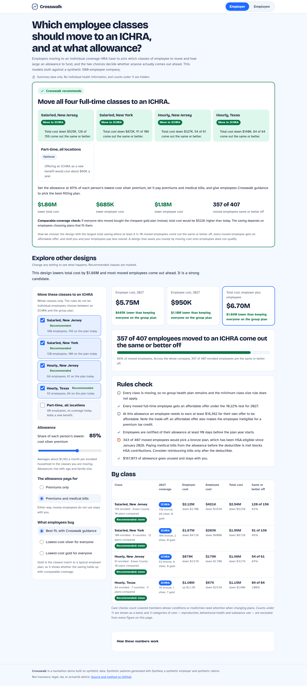
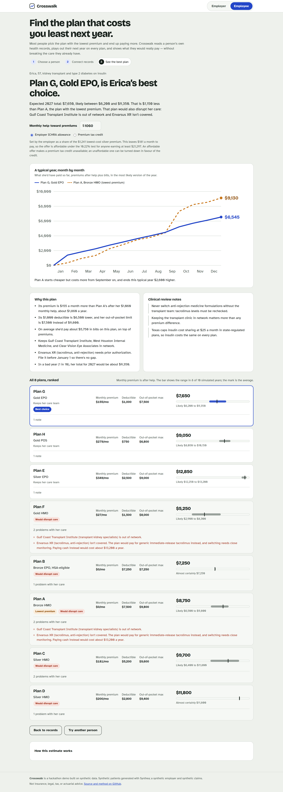
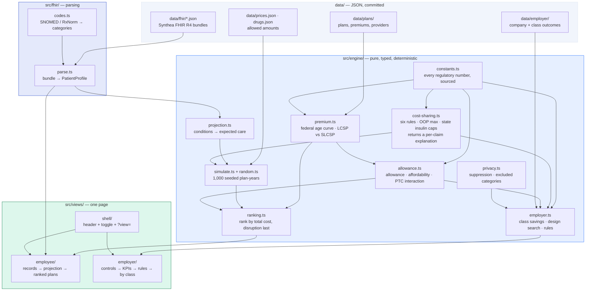

# Crosswalk

**Two-sided ICHRA decision support on one typed engine: employers model which employee classes to move and what allowance to set; employees pick the individual plan with the lowest expected total cost of care, from their own FHIR records.**

**→ [Live demo](https://adam-behun.github.io/crosswalk/)** · [Employer view](https://adam-behun.github.io/crosswalk/?view=employer) · [Employee view](https://adam-behun.github.io/crosswalk/?view=employee)

Synthetic data only. Not insurance, legal, tax, or actuarial advice.

### The employer view — which classes to move, and at what allowance

[](https://adam-behun.github.io/crosswalk/?view=employer)

### The employee view — which plan actually costs least

[](https://adam-behun.github.io/crosswalk/?view=employee)

---

## The problem

An employer moving from a group health plan to an **ICHRA** (Individual Coverage HRA, which CMS and the SBA began calling a **CHOICE Arrangement** in September 2026) has to decide two things: which **employee classes** to move, and how large an allowance to fund. Those two choices decide whether anyone comes out ahead — set the allowance too low and the offer fails the **ICHRA affordability** test and exposes the employer to a penalty; set it too high and the saving disappears. Most employers make the call on a spreadsheet of premiums, with no view of what their people actually spend.

Their employees then face the same problem one layer down. Handed an allowance and sent to the **ACA marketplace**, people overwhelmingly pick the plan with the lowest premium — and frequently pay more over the year, because the premium is not the price. A bronze plan with a $7,500 deductible is the cheapest plan on the shelf and the most expensive plan for someone on insulin. Worse, the cheapest plan may be the one that drops their oncologist.

Crosswalk models both sides on the same engine, so the allowance the employer sets is the allowance the employee spends.

---

## How it works

**Employee side.** A Synthea-generated **FHIR R4** bundle is parsed into conditions, medications, encounters and **ExplanationOfBenefit** claims. Condition categories drive a projection of next year's care — a transplant implies clinic visits every two months and monthly drug-level labs, a pregnancy implies a delivery and the deductible going with it. That projection is then played out as **1,000 simulated plan-years** (**Monte Carlo simulation**, seeded so results are reproducible), and every plan is priced against the *same* thousand years, so the difference between two plans is the difference in their rules rather than in their luck. Plans are ranked by expected **total cost of care** — premium after allowance plus deductible, copays and coinsurance, capped at the out-of-pocket maximum — and any plan that would drop a critical provider or stop covering a drug someone depends on is ranked **last, whatever it costs**.

**Employer side.** The same cost-sharing and premium code runs over employee classes. For each design — which classes move, at what share of the **lowest-cost silver plan**, spent on premiums or also on bills — it computes total employer cost, total employee cost, how many people come out the same or better off, and whether the offer clears the **ICHRA affordability** threshold. It searches all 270 designs and recommends the one with the largest total saving where at least 8 in 10 moved employees are no worse off *and both sides pay less*. A design that saves the employer money by moving cost onto employees does not qualify.

**Privacy.** The employee view shows a person their whole record, because it is theirs. The employer view never sees an individual: it gets class aggregates, **small-cell suppression** below 11, and reproductive, behavioural-health and substance-use care excluded at every count — **HIPAA minimum necessary** applied as a structural property of the data rather than a render-time filter. A test walks the employer dataset, every evaluated design and the recommendation to prove no member-level field is present, then proves the guard can fail.

---

## Architecture



The engine is pure and deterministic: no DOM, no network, no clock, no `Math.random`. Both views import the same modules, which is the point — the allowance the employer sets and the allowance the employee spends are the same function.

---

## Assumptions and data sources

### Regulatory numbers

Every regulatory figure is a named constant in [`src/engine/constants.ts`](src/engine/constants.ts) with its primary citation in a comment.

| Constant | Value | Source |
|---|---|---|
| ICHRA affordability percentage, 2027 | **10.22%** | IRS Rev. Proc. 2026-26 |
| Minimum class size | 10 (<100 employees) · 10% (100–200) · **20 (>200)** | HRA final rules, 84 FR 28888; 26 CFR 54.9802-4(d) |
| Permitted employee classes | 11 | HRA final rules; 26 CFR 54.9802-4(a)(3) |
| ICHRA notice period | 90 days before the plan year | 26 CFR 54.9802-4(c)(6) |
| Federal default age curve | 0.765 (0–14) · 1.000 (21–24) · 1.278 (40) · 3.000 (64) | CMS age-curve guidance; 45 CFR 147.102(e) |
| Age-rating limit | 3:1 for adults | 45 CFR 147.102(a)(1)(iii) |
| Insulin cap, Texas | $25 per 30-day supply | TX SB 827 (2021); Tex. Ins. Code § 1358.103 |
| Insulin cap, New Jersey | $35 per 30-day supply, no deductible | N.J. P.L. 2023 c.105 (S1614) |
| Insulin cap, New York | $0 per 30-day supply | NY enacted FY2025 budget |
| Bronze/catastrophic plans HSA-eligible | from 1 January 2026 | OBBBA § 71307; IRC § 223(c)(2); IRS Notice 2026-05 |
| Open enrollment, 2027 plan year | 1 Nov 2026 – 15 Jan 2027 (NY and NJ to 31 Jan) | CMS; 45 CFR 155.410(e) |
| Enhanced premium tax credits | lapsed after 31 December 2025 | ARPA/IRA enhancement sunset |
| Small-cell suppression threshold | 11 | 45 CFR 164.514(b); CMS public-use-file policy |

**CHOICE Arrangement — current status.** CMS and the SBA began calling ICHRA the "CHOICE Arrangement" on 3 September 2026. That is an administrative rename; the governing regulations are unchanged. Statutory codification is separate and **has not happened**: H.R. 6703 passed the House on 17 December 2025 and has not been enacted. Nothing here depends on codification.

**QSEHRA**, by contrast, is available only to employers with fewer than 50 employees, cannot be offered alongside a group health plan, and is capped by statute rather than set by the employer. It is the wrong instrument for the 500-employee company modelled here. No QSEHRA dollar figures are quoted, for the reason below.

### Numbers we could not confirm

The container this was built in **cannot reach `irs.gov`, `cms.gov`, `hhs.gov` or `ecfr.gov`** — the network proxy answers 403 to all four. Every figure above was therefore verified against reputable secondary sources rather than read off a primary government page. For anything dated after mid-2025, the secondary source URL is in the constant's comment. Please check these yourself:

- **10.22% for 2027** — [WTW](https://www.wtwco.com/en-us/insights/2026/07/irs-announces-2027-aca-affordability-percentage), [Mercer](https://www.mercer.com/insights/law-and-policy/2027-affordability-percentage-for-employer-health-coverage-increases/)
- **CHOICE rename and H.R. 6703** — [PeopleKeep](https://www.peoplekeep.com/blog/what-is-the-choice-arrangement), [Becker's](https://www.beckerspayer.com/policy-updates/ichra-legislation-in-congress-3-bills-to-know/)
- **Bronze/catastrophic HSA eligibility, OBBBA § 71307 and Notice 2026-05** — [Lively](https://livelyme.com/guides/obbb-hsa-guide)
- **Open enrollment dates** — [Summit](https://www.summithealthbenefits.com/blog/health-insurance-open-enrollment-dates-and-changes)
- **State insulin caps** — [American Diabetes Association](https://diabetes.org/tools-resources/affordable-insulin/state-insulin-copay-caps), [NJ Legislature](https://pub.njleg.gov/Bills/2022/PL23/105_.HTM)

Four things are **flagged rather than asserted**:

1. **Federal age curve, ages 15–20.** The factors for 0–14, 21–24, 25, 40 and 64 are confirmed. The six factors for ages 15–20 could not be verified against any reachable source and are labelled unconfirmed in the code. No persona or class in this app is aged 15–20, so nothing shown depends on them; they exist so a dependent in that band yields a finite premium rather than `NaN` — which is the bug the prototype had, its curve jumping straight from 14 to 21. Tests assert only finiteness, ordering and the 3:1 bound for that band.
2. **New York's $0 insulin cap.** The value is confirmed; the exact statutory section is not.
3. **QSEHRA 2026 dollar limits.** Not confirmed, so QSEHRA is contrasted structurally with no figures quoted.
4. **KFF-sourced figures** — the 2025 employer-plan averages used for the group-plan baseline, and the 2026 Texas lowest-cost premiums the sample plans are anchored to — are carried over from the prototypes and were not independently re-confirmed.

### Data

| What | Where | Provenance |
|---|---|---|
| Patients | `data/fhir/*.json` | **Unmodified Synthea FHIR R4 output.** 400 Houston adults aged 25–64, seed `20270101`; the four shipped bundles are the best match for each clinical profile. See [`data/fhir/MANIFEST.md`](data/fhir/MANIFEST.md) for the command, the seed, the checksums and which prototype persona each one stands in for. `npm run personas` reproduces them. |
| Sample plans | `data/plans/houston-sample-2026.json` | Eight plans modelled on 2026 Houston-area marketplace plans. Premiums anchored to KFF's 2026 Texas lowest-cost premiums for a 40-year-old (bronze $426, silver $651, gold $570), age-rated with the federal curve. **Deductibles, copays, networks and drug lists are sample data, not any insurer's actual plan.** |
| Prices | `data/prices.json`, `data/drugs.json` | Estimated allowed amounts: $165 primary care, $275 specialist, $2,600 emergency, ~$24,000 inpatient, $16,000 delivery. |
| Employer | `data/employer/` | A synthetic 500-employee company across NJ, NY and TX. |

**What is precomputed, and why.** Each employee class's cost under each of the 54 designs is *output* from a household-level model that ran against the real 2026 county plan files (CMS PY2026 Exchange PUF for Texas, NJ DOBI rate filings and carrier SBCs, NY State of Health plan search). Those files are not redistributed here, so those outcomes ship as data, labelled as such in `data/employer/class-outcomes.json` and in the app's own assumptions panel. Everything else on the employer side — the allowance arithmetic, the affordability threshold, the savings, the design search, the rules checks and the suppression — is computed live in the browser by the same engine the employee view uses.

**Synthea's labs are not always coherent with Synthea's diagnoses.** The transplant persona carries a type 2 diabetes diagnosis and an insulin prescription alongside a generated A1c of 3.82%, which is not a value a person on insulin would have. Nothing is cleaned up on the way through: the app shows what the bundle says, and the projection rules only act on a lab value where it falls in the range they are written for. Correcting generated data silently would be the worse failure.

**Networks and formularies are simulated.** No public plan file carries provider rosters or drug lists, so the **network adequacy and formulary checks** — including the **prior authorization** flags — run against a sample provider directory. They demonstrate the check; they are not statements about any real insurer's network. The employer side does not check networks at all.

**Price transparency.** The CMS Exchange Public Use Files are the public **price transparency** source this is built to consume. Replacing the sample plans with the real Harris County plans is the next step, including each plan's live Summary of Benefits and Coverage link; [`scripts/check-links.ts`](scripts/check-links.ts) and [`.github/workflows/links.yml`](.github/workflows/links.yml) already exist to verify those links resolve, and run on GitHub's network because this build environment cannot reach insurer domains.

---

## Running it locally

```bash
npm install
npm run dev          # http://localhost:5173/crosswalk/
```

```bash
npm test             # 192 tests across the engine and the FHIR parser
npm run typecheck    # strict TypeScript, no `any` in src/engine or src/fhir
npm run coverage
npm run build        # typecheck, then build to dist/
npm run preview
```

Regenerating the data:

```bash
# Synthea bundles. Needs Java 11+ and synthea-with-dependencies.jar from
# https://github.com/synthetichealth/synthea/releases
npm run personas -- --jar /path/to/synthea-with-dependencies.jar

npm run screenshots  # drives the built app in Chromium; fails on console errors
```

Tests cover each cost-sharing rule (copay, deductible, coinsurance, copay after deductible, coinsurance after deductible, out-of-pocket maximum, and the Texas, New Jersey and New York insulin caps), the affordability test, allowance arithmetic, plan ranking (plans that disrupt care rank last), the FHIR parser against the shipped bundles and against deliberately malformed input, and the privacy guarantees.

---

## Disclaimer

Everything here is **synthetic**. The patients are Synthea-generated and are not real people. The employer, its employees and their claims are invented. The sample plans are modelled, not sold by anyone, and their networks and drug lists are fabricated.

This is a hackathon demo. It is **not insurance, legal, tax, or actuarial advice**, and must not be used to choose a health plan or design a benefits programme. Regulatory figures were checked on 6 October 2026 against secondary sources, with the limitations above; verify every one of them against the primary source before relying on it.
