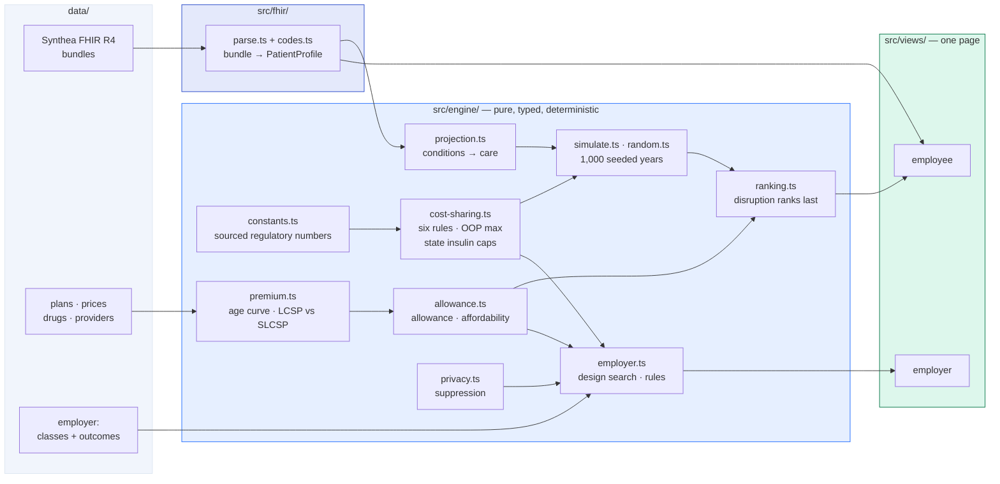

# Crosswalk

**Two-sided ICHRA decision support on one typed engine: employers model which employee classes to move and what allowance to set; employees pick the individual plan with the lowest expected total cost of care, from their own FHIR records.**

**→ [Live demo](https://adam-behun.github.io/Crosswalk/)** · [Employer view](https://adam-behun.github.io/Crosswalk/?view=employer) · [Employee view](https://adam-behun.github.io/Crosswalk/?view=employee)

Synthetic data only. Not insurance, legal, tax, or actuarial advice.

[](https://adam-behun.github.io/Crosswalk/?view=employer)

[](https://adam-behun.github.io/Crosswalk/?view=employee)

---

## The problem

An employer moving from a group health plan to an **ICHRA** (Individual Coverage HRA, renamed the **CHOICE Arrangement** by CMS and the SBA in September 2026) has to choose which **employee classes** to move and how large an allowance to fund. Those two choices decide whether anyone comes out ahead: too low and the offer fails the **ICHRA affordability** test and risks a penalty, too high and the saving disappears. Most employers decide on a spreadsheet of premiums, with no view of what their people actually spend.

Their employees then hit the same problem one layer down. Handed an allowance and sent to the **ACA marketplace**, people pick the lowest premium — and often pay more over the year, because the premium is not the price. A bronze plan with a $7,500 deductible is the cheapest plan on the shelf and the most expensive plan for someone on insulin. It may also be the one that drops their oncologist.

## How it works

**Employee side.** A Synthea **FHIR R4** bundle is parsed into conditions, medications, encounters and **ExplanationOfBenefit** claims. Condition categories drive a projection of next year's care — a transplant implies clinic visits every two months and monthly drug-level labs. That projection runs as **1,000 seeded simulated plan-years** (**Monte Carlo**), with every plan priced against the *same* thousand years, so the difference between two plans is the difference in their rules rather than in their luck. Plans rank by expected **total cost of care** — premium after allowance, plus deductible, copays and coinsurance, capped at the out-of-pocket maximum — and any plan that would drop a critical provider or stop covering a drug someone depends on ranks **last, whatever it costs**.

**Employer side.** The same cost-sharing and premium code runs over employee classes. For each design — which classes move, at what share of the **lowest-cost silver plan**, spent on premiums or also on bills — it computes employer cost, employee cost, how many people are no worse off, and whether the offer clears the affordability threshold. It searches all 270 designs and recommends the largest total saving where at least 8 in 10 moved employees are no worse off *and both sides pay less*. A design that saves the employer money by shifting cost onto employees does not qualify.

**Privacy.** The employee view shows a person their whole record, because it is theirs. The employer view never sees an individual: class aggregates only, **small-cell suppression** below 11, and reproductive, behavioural-health and substance-use care excluded at every count — **HIPAA minimum necessary** as a structural property of the data, not a render-time filter. A test walks the dataset, every evaluated design and the recommendation to prove no member-level field exists, then proves the guard can fail.

## Architecture



No DOM, network, clock or `Math.random` in the engine. Both views import the same modules — the allowance the employer sets and the allowance the employee spends are the same function.

## Running it

```bash
npm install
npm run dev          # http://localhost:5173/Crosswalk/

npm test             # 206 tests across the engine and the FHIR parser
npm run typecheck    # strict TS, no `any` in src/engine or src/fhir
npm run build        # typecheck, then build to dist/
npm run screenshots  # drives the built app in Chromium; fails on console errors

# Regenerate the Synthea bundles (needs Java 11+ and synthea-with-dependencies.jar)
npm run personas -- --jar /path/to/synthea-with-dependencies.jar
```

Tests cover each cost-sharing rule (copay, deductible, coinsurance, copay after deductible, coinsurance after deductible, out-of-pocket maximum, and the Texas, New Jersey and New York insulin caps), the affordability test, allowance arithmetic, ranking, the FHIR parser against the shipped bundles and against malformed input, and the privacy guarantees.

## Assumptions and sources

Every regulatory figure is a named constant in [`src/engine/constants.ts`](src/engine/constants.ts) with its primary citation in a comment.

| | | |
|---|---|---|
| ICHRA affordability, 2027 | **10.22%** | IRS Rev. Proc. 2026-26 |
| Minimum class size | 10 / 10% / **20** by employer size | 84 FR 28888; 26 CFR 54.9802-4(d) |
| Employee classes · notice period | 11 · 90 days | 26 CFR 54.9802-4 |
| Federal age curve · rating limit | 0.765 → 3.000 · 3:1 | 45 CFR 147.102(e), (a)(1)(iii) |
| Insulin caps TX / NJ / NY | $25 · $35 no deductible · $0 | TX SB 827; NJ P.L. 2023 c.105; NY FY2025 budget |
| Bronze/catastrophic HSA-eligible | from 2026-01-01 | OBBBA § 71307; IRS Notice 2026-05 |
| Enhanced premium tax credits | lapsed after 2025-12-31 | ARPA/IRA sunset |
| Small-cell suppression | 11 | 45 CFR 164.514(b) |

**CHOICE Arrangement status.** CMS and the SBA renamed ICHRA the "CHOICE Arrangement" on 3 September 2026 — an administrative rename, regulations unchanged. Statutory codification has *not* happened: H.R. 6703 passed the House on 17 December 2025 and was not enacted. **QSEHRA** is contrasted structurally only (small employers, no group plan alongside, statutory cap), with no dollar figures, for the reason below.

### What I could not confirm

This was built in a container that **cannot reach `irs.gov`, `cms.gov`, `hhs.gov` or `ecfr.gov`** — all four answer 403. Every figure above was verified against reputable secondary sources instead, each linked in the constant's comment. **Please check these yourself.** Four things are flagged rather than asserted:

1. **Age-curve factors for ages 15–20.** The 0–14, 21–24, 25, 40 and 64 factors are confirmed; those six are not, and are labelled unconfirmed in code. Nobody in this app is 15–20, so nothing shown depends on them — they exist so a dependent in that band yields a finite premium rather than `NaN`, which is the bug the prototype had.
2. **New York's $0 insulin cap** — value confirmed, statutory section not.
3. **QSEHRA 2026 dollar limits** — not confirmed, so none are quoted.
4. **KFF figures** carried over from the prototypes (2025 employer-plan averages, 2026 Texas lowest-cost premiums) — not independently re-confirmed.

### Data

**Patients** (`data/fhir/`) are unmodified Synthea FHIR R4 output: 400 Houston adults aged 25–64 at seed `20270101`, with the four best matches shipped. [`data/fhir/MANIFEST.md`](data/fhir/MANIFEST.md) has the command, checksums and which prototype persona each stands in for.

**Plans** (`data/plans/houston-sample-2026.json`) are eight plans modelled on 2026 Houston-area marketplace plans, premiums anchored to KFF's 2026 Texas lowest-cost figures for a 40-year-old and age-rated with the federal curve. Deductibles, copays, networks and drug lists are sample data, not any insurer's actual plan.

**Employer** (`data/employer/`) is a synthetic 500-employee company across NJ, NY and TX. Each class's cost under each of 54 designs is *output* from a household-level model run against the real 2026 county plan files (CMS PY2026 Exchange PUF, NJ DOBI filings, NY State of Health). Those files are not redistributed, so those outcomes ship as labelled data; everything else on that side computes live in the browser.

**Networks and formularies are simulated.** No public plan file carries provider rosters or drug lists, so the **network adequacy and formulary checks** — including **prior authorization** flags — run against a sample directory. They demonstrate the check; they are not claims about any real insurer's network.

**Synthea's labs are not always coherent with Synthea's diagnoses.** The transplant persona has type 2 diabetes and an insulin prescription alongside a generated A1c of 3.82%. Nothing is cleaned up on the way through: the app shows what the bundle says, and projection rules only act on values inside the range they are written for. Silently correcting generated data would be the worse failure.

The CMS Exchange Public Use Files are the public **price transparency** source this is built to consume. [`scripts/import-cms-puf.ts`](scripts/import-cms-puf.ts) and [`.github/workflows/import-plans.yml`](.github/workflows/import-plans.yml) import real Harris County plans from them and open a PR with the result; they are committed but not yet run.

## Disclaimer

Everything here is **synthetic**. The patients are Synthea-generated and are not real people. The employer, its employees and their claims are invented. The sample plans are modelled, sold by nobody, and their networks and drug lists are fabricated.

This is a hackathon demo. It is **not insurance, legal, tax, or actuarial advice** and must not be used to choose a health plan or design a benefits programme. Regulatory figures were checked on 6 October 2026 against secondary sources, with the limitations above; verify each against the primary source before relying on it.
